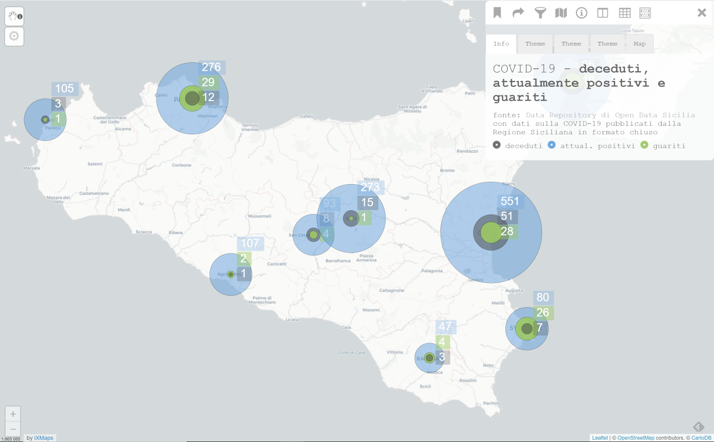

## CODID-19 - Sicilia

## Visualizzazioni di dati curati da Open Data Sicilia 

Visualizzazione degli dati collezionati e curati di Open Data Sicilia e pubblicati da parte loro in un documento Google Sheet

fonte: <a href='https://github.com/opendatasicilia/COVID-19_Sicilia' target='_blank'>Open Data Sicilia</a>

[Numeri attuali](http://view.ixmaps.com?project=https://raw.githubusercontent.com/gjrichter/viz/master/COVID-19/COVID-19-ODS/projects/ixmaps_project_ODS_Prov2019_COVID_concentric_zoom.json)

[Milano](http://view.ixmaps.com?project=https://raw.githubusercontent.com/gjrichter/viz/master/IstatPendolari/ixmaps_project_pendolari_colori_Milano.json)

[Puglia](http://view.ixmaps.com?project=https://raw.githubusercontent.com/gjrichter/viz/master/IstatPendolari/ixmaps_project_pendolari_colori_Puglia.json)

[Sicilia](http://view.ixmaps.com?project=https://raw.githubusercontent.com/gjrichter/viz/master/IstatPendolari/ixmaps_project_pendolari_colori_Sicilia.json)

[Italia](http://view.ixmaps.com?project=https://raw.githubusercontent.com/gjrichter/viz/master/IstatPendolari/ixmaps_project_pendolari_colori_Italia.json)

