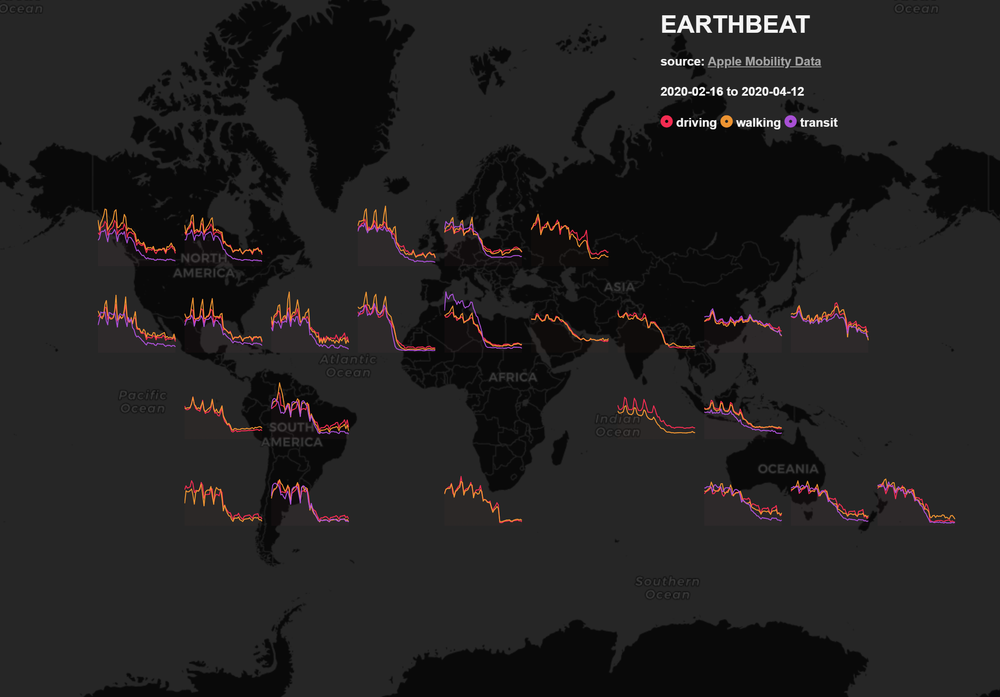

## CODID-19 - Apple Mobility Trends

Visualization of data release by Apple Inc. to support COVID-19 Policy making. 

fonte: <a href='https://www.apple.com/covid19/mobility' target='_blank'>Apple Maps Mobility Trends Reports</a>

[EARTHBEAT](http://view.ixmaps.com?project=https://raw.githubusercontent.com/gjrichter/viz/master/COVID-19/projects/COVID-19-ODS/ixmaps_project_ODS_Prov2019_COVID_concentric_zoom.json)
(Mobility Trend Data by Country aggregated on a dynamic  rectangular grid)

