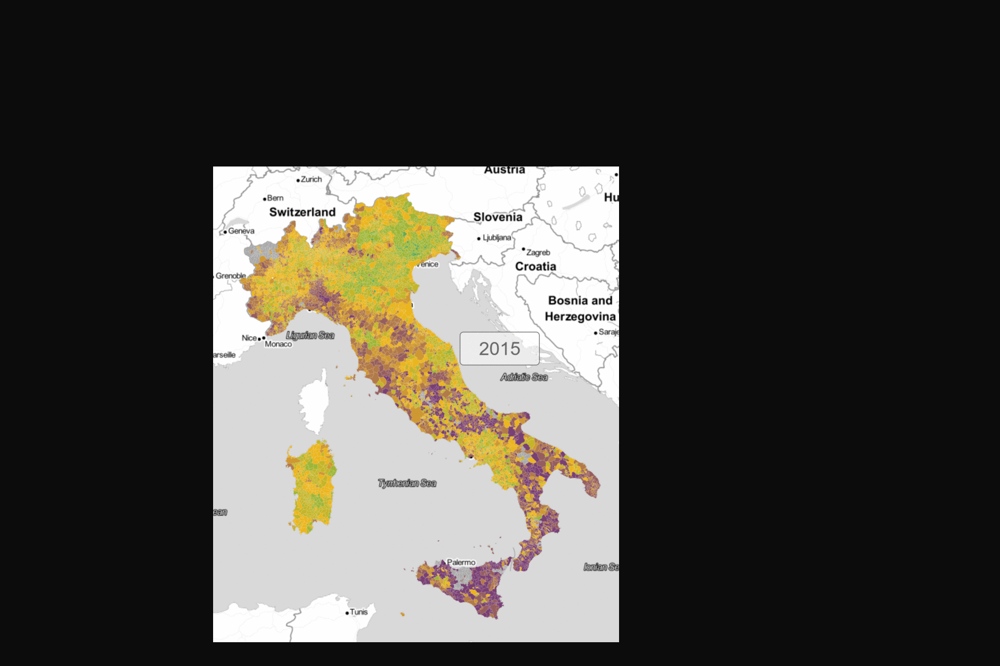

## ISPRA - Catasto dei Rifiuti

## Raccolta Differenziata da 2010 al 2017 - a base di un CSV aggregato da OnData

Visualizzazione del percentuale della Raccolta Differenziata per tutti comuni d'Italia dal 2010 al 2017

fonte dati: [Ondata](https://github.com/ondata/rifiutiUrbaniComunaliISPRA), ISTAT e ISPRA

[% Raccolta Differenziata dal 2010 al 2017 (sequenza)](http://view.ixmaps.com?project=https://raw.githubusercontent.com/gjrichter/viz/master/CatastoRifiuti/ixmaps_project_RD_ONDATA_2010_2017_clip.json)

  

