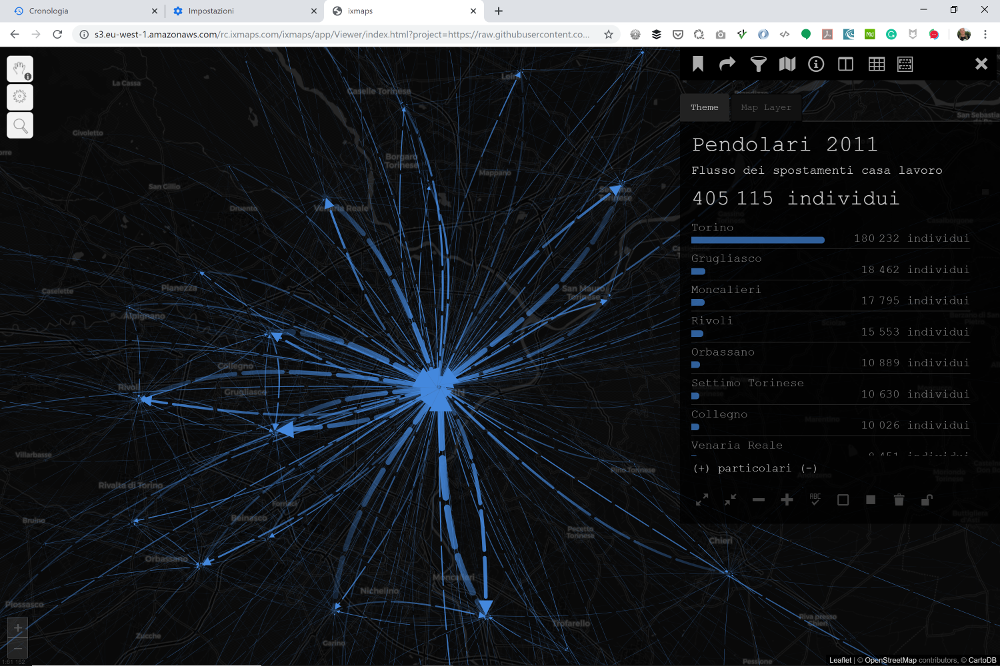
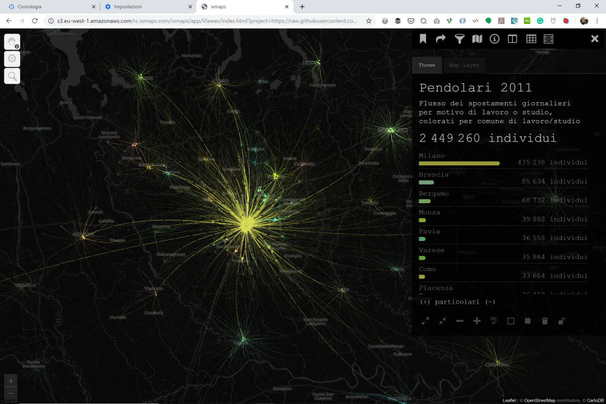
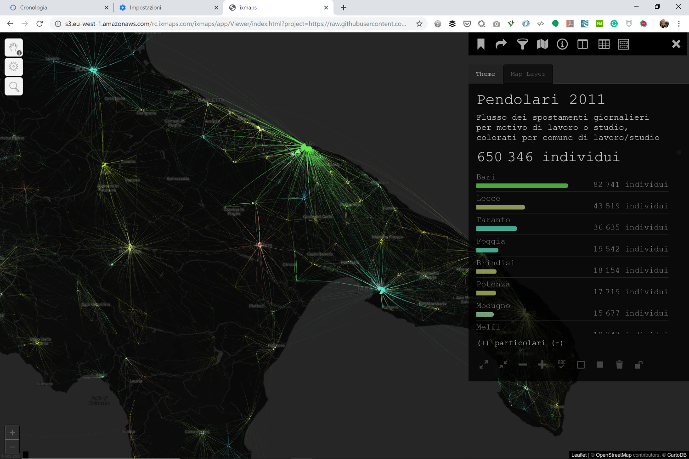
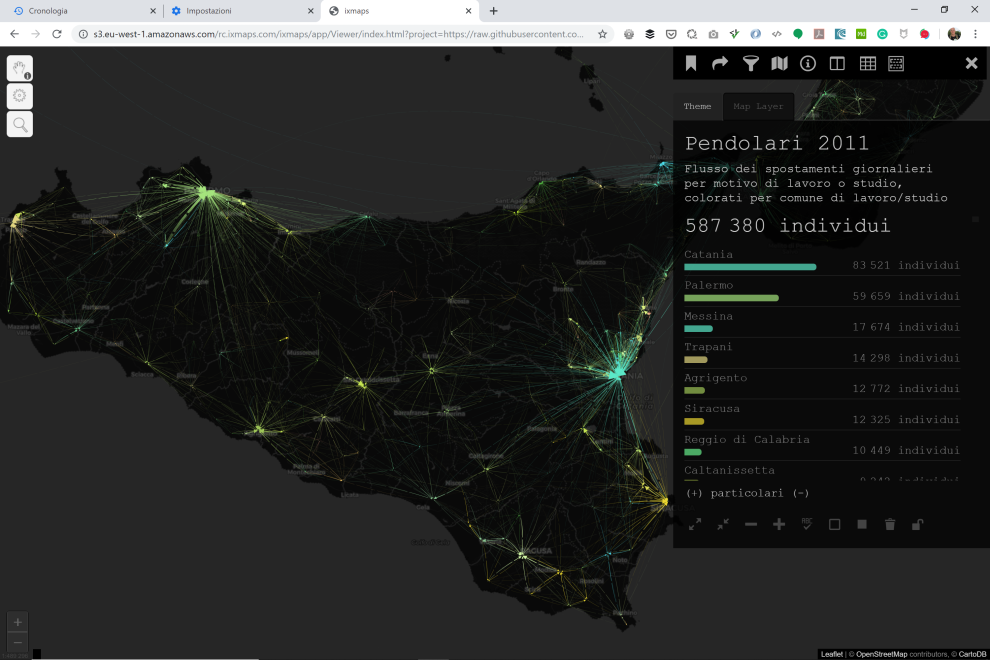
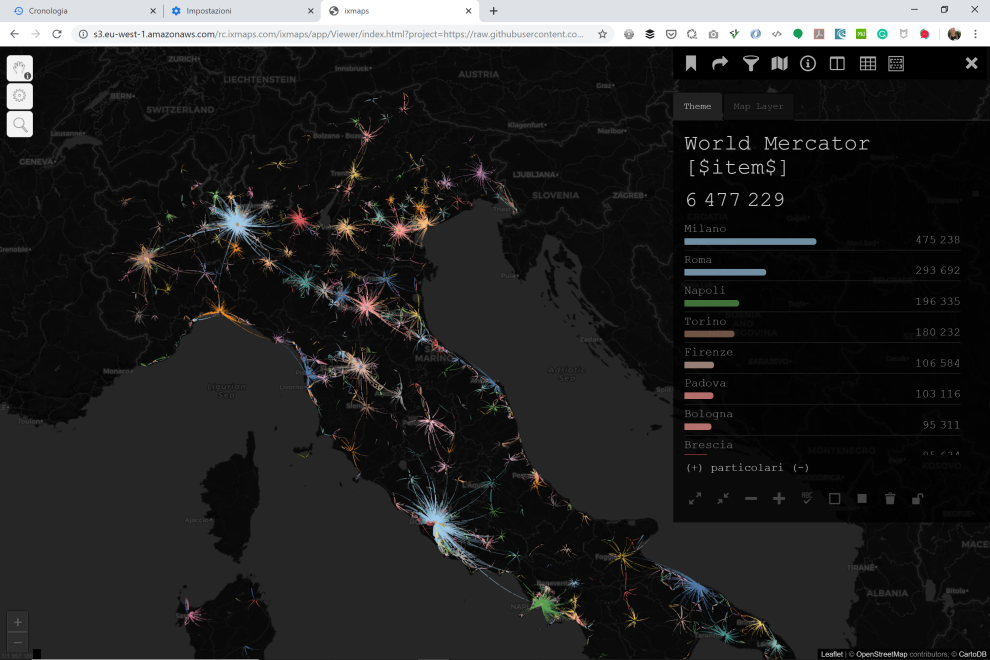

## ISTAT -  flussi pendolari

## Spostamenti per motivi di lavoro o di studio della popolazione residente 

## a base  del file *matrix_pendo2011.txt*

Visualizzazione degli spostamenti per motivi di lavoro o di studio per tutti comuni d'Italia nel 2011

fonte dati: ISTAT 

[Torino (monocolore)](http://view.ixmaps.com?project=https://raw.githubusercontent.com/gjrichter/viz/master/IstatPendolari/ixmaps_project_pendolari_mono_dash_torino.json)

[Milano](http://view.ixmaps.com?project=https://raw.githubusercontent.com/gjrichter/viz/master/IstatPendolari/ixmaps_project_pendolari_colori_Milano.json)

[Puglia](http://view.ixmaps.com?project=https://raw.githubusercontent.com/gjrichter/viz/master/IstatPendolari/ixmaps_project_pendolari_colori_Puglia.json)

[Sicilia](http://view.ixmaps.com?project=https://raw.githubusercontent.com/gjrichter/viz/master/IstatPendolari/ixmaps_project_pendolari_colori_Sicilia.json)

[Italia](http://view.ixmaps.com?project=https://raw.githubusercontent.com/gjrichter/viz/master/IstatPendolari/ixmaps_project_pendolari_colori_Italia.json)

